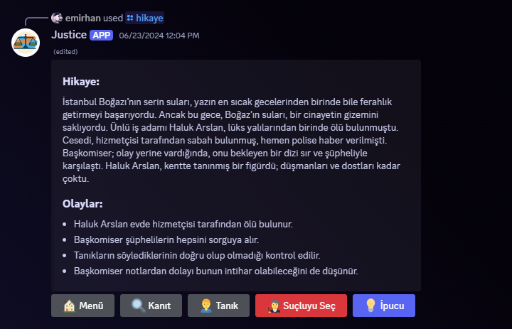

# Justice Discord Bot

Justice, sizi hikayeleriyle eğlenceli bir vakit geçirmenize olanak sağlar.

## İşlevler

- **/hikaye** Komutu: Bu komut kullanıldığında bot, veritabanında bulunan hikayeleri eğlenceli bir şekilde sunar.

## Nasıl Kullanılır?

1. **Hikaye Oluştur Komutu:**
   - Komutu kullandığınızda ekrana gelen formdaki tüm fieldsları doldurun ve sonrasında artık yazılan hikaye veritabanına eklenmiş olucaktır.
   

2. **Coin Komutu:**
   - Hikaye komutunda gözüken ipucu kısmı hikayede rastgele olarak gizlenmiş olan bir ipucunu 1 coin karşılığında açabilirsiniz.
   - Coin kazanmak için /coin komutundan daha detaylı bilgi alabilirsiniz.

## Config Dosyası Ayarları

| Değer         | Açıklama                             | Örnek Değer        |
|---------------|--------------------------------------|---------------------|
| `token`       | Discord bot tokeni                    | `"discord_token"`  |
| `clientId`    | Discord bot idsi                      | `"discord_bot_id"` |
| `prefix`      | Çıktıların önünde bulunan isim           | `"Justice"`     |
| `StoryPerm`    | Hikaye oluşturma sorumlusu                      | `"discord_role_id"` |
| `DPlaceAPI`    | [discord.place](https://docs.discord.place) daha detaylı bilgi için                      | `"discord_place_key"` |
| `MongoUri` | Hikaye veritabanı bağlantı URL'si     | `"mongodb://localhost"` |

## Ekran Görüntüleri

1. **/hikaye Komutu Örneği:**
   

